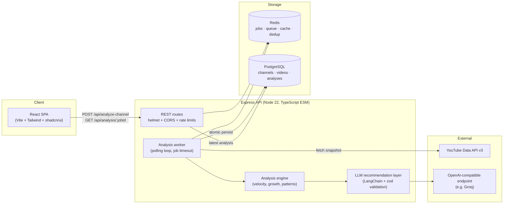
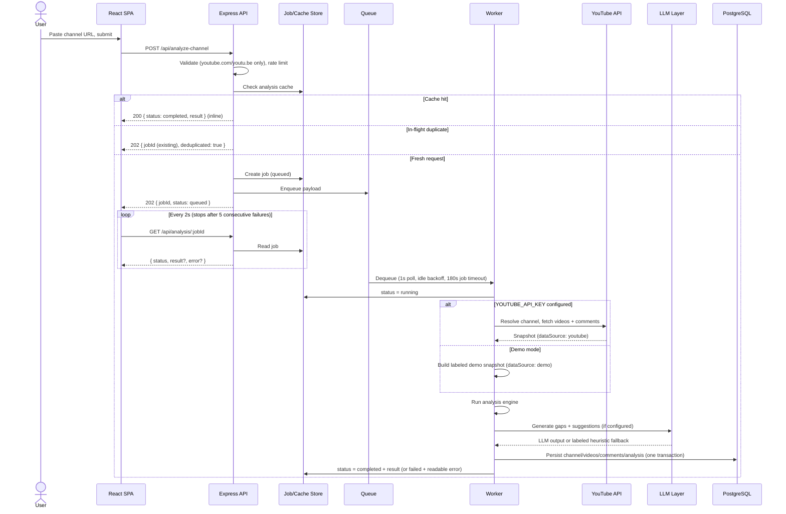
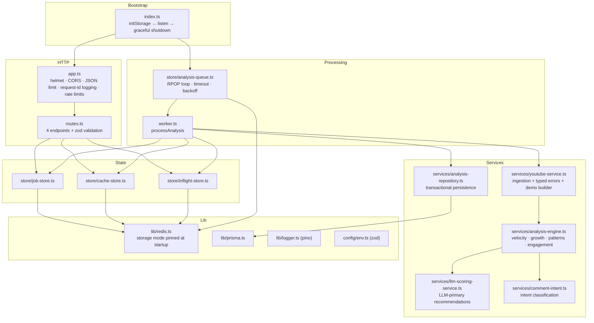
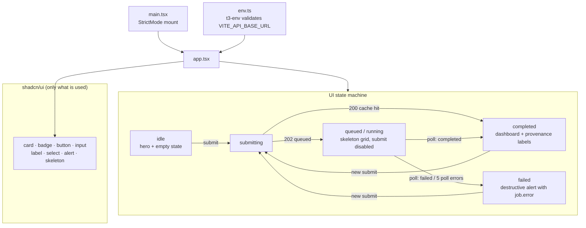
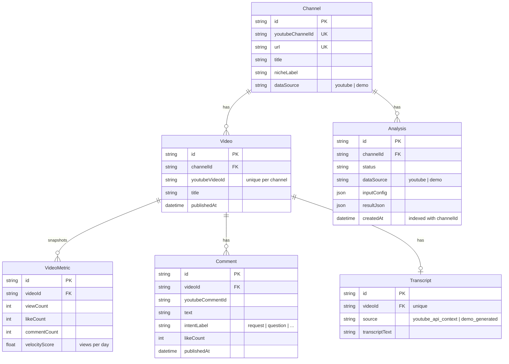
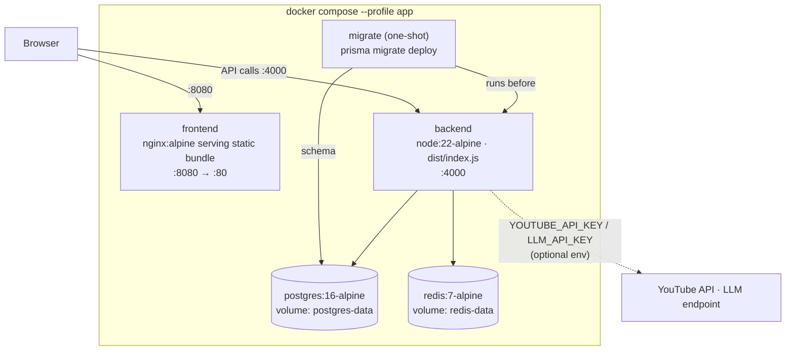

# YT Insight Engine

[](https://github.com/umer-2k1/yt-insights-engine/actions/workflows/ci.yml)
[](LICENSE)


**A creator-intelligence dashboard that answers one question: _what should I publish next, based on what is working in my niche right now?_**

Paste a YouTube channel URL and YT Insight Engine ingests the channel's recent videos and comments, runs an analysis pipeline over them, and renders a decision-first dashboard: winning themes, accelerating topics, content gaps, publish-ready video ideas, title patterns, posting cadence, and engagement signals.

- **Honest by design** — every result is labeled with its provenance: real YouTube data (`youtube`) or clearly-marked sample data (`demo`), and recommendations are tagged `AI-generated` or `Rule-based`.
- **Zero-config demo** — runs end-to-end with no API keys, no database, and no Redis. Add each when you want it.
- **Production-shaped** — async job queue, storage-mode coordination, atomic persistence, rate limiting, typed error propagation, structured logging, graceful shutdown, tests, CI, and Docker.

---

## Table of Contents

- [How It Works](#how-it-works)
- [Demo Mode vs Real Mode](#demo-mode-vs-real-mode)
- [Architecture](#architecture)
  - [System Architecture](#system-architecture)
  - [Request Lifecycle](#request-lifecycle)
  - [Backend Architecture](#backend-architecture)
  - [Frontend Architecture](#frontend-architecture)
  - [Database Schema](#database-schema)
  - [Deployment Architecture](#deployment-architecture)
- [Getting Started](#getting-started)
- [Configuration](#configuration)
- [API Reference](#api-reference)
- [Testing](#testing)
- [Project Structure](#project-structure)
- [Limitations & Roadmap](#limitations--roadmap)
- [License](#license)

---

## How It Works

1. You submit a channel URL (and how many recent videos to analyze, 5–50).
2. The API validates the URL, deduplicates concurrent identical requests, and enqueues an analysis job.
3. A worker fetches the channel snapshot (videos, stats, sampled comments) from the YouTube Data API — or generates labeled demo data when no key is configured.
4. The analysis engine computes themes by view velocity, real growth signals (recent-half vs older-half velocity), format and title-pattern performance, posting cadence, and engagement rates.
5. An optional LLM layer (any OpenAI-compatible endpoint) generates content gaps and suggested videos grounded in the actual titles and comments; a rule-based generator is the labeled fallback.
6. Results are cached, persisted atomically to PostgreSQL (when configured), and polled by the dashboard.

## Demo Mode vs Real Mode

| | Demo mode (default) | Real mode |
|---|---|---|
| Requires | Nothing | `YOUTUBE_API_KEY` |
| Channel data | Deterministic sample videos + comments, labeled `dataSource: "demo"` end-to-end (API flag, UI banner, DB columns) | Live channel videos, stats, and comments, labeled `dataSource: "youtube"` |
| API failures | n/a | Surface as failed jobs with readable messages (`quota exceeded`, `channel not found`, …) — never silently replaced with fake data |
| Recommendations | Rule-based (labeled) | LLM-generated when `LLM_API_KEY` is set, rule-based fallback otherwise (always labeled) |

## Architecture

### System Architecture



Redis is optional: the job store, queue, cache, and dedup claims all fall back to coordinated in-memory implementations (single-instance only). PostgreSQL is optional: without it, results live in the cache/job store and skip persistence.

### Request Lifecycle



### Backend Architecture



Key decisions:

- **Storage mode is pinned once at startup** (`initStorage()`): Redis or memory, never per-operation. A flapping Redis can no longer split a job between backends (job created in Redis, queued in memory, never processed).
- **The worker owns job state after creation** — updates merge fields so a status-only write never clobbers a stored result or error. A 180s timeout (`JOB_TIMEOUT_MS`) fails stuck jobs instead of stranding clients on `running` forever.
- **Real API errors are typed** (`quota_exceeded`, `channel_not_found`, `no_videos`, `api_error`) and become user-visible job failures. Demo data is a configuration state, not an error fallback.
- **Persistence is one transaction**: replace videos + metrics + comments + transcript and append the analysis atomically, so readers never observe half-written channels.

### Frontend Architecture



The dashboard renders honest states: a pre-first-run empty state (no wall of blank cards), skeletons while processing, the job's actual error on failure, a persistent **Demo data** banner when `dataSource === "demo"`, and `AI-generated` / `Rule-based` chips on recommendation cards.

### Database Schema



`youtubeVideoId` is unique **per channel** (`@@unique([channelId, youtubeVideoId])`) — video ids are only meaningful within their channel, and global uniqueness broke multi-channel demo ingestion.

### Deployment Architecture



`docker compose up` alone starts only the dev infrastructure (Postgres on host port **5433**, Redis on 6379). The `app` profile adds the migration one-shot, the API, and the nginx-served frontend.

## Getting Started

**Prerequisites:** Node ≥ 20.19 (22 recommended — see `.nvmrc`), pnpm 10, Docker (optional, for Postgres/Redis/full-stack).

### 1. Instant demo (zero keys, zero infrastructure)

```bash
# backend
cd backend
pnpm install
pnpm prisma:generate
cp .env.example .env        # works as-is; leave keys empty for demo mode
pnpm dev                    # http://localhost:4000

# frontend (new terminal)
cd frontend
pnpm install
cp .env.example .env        # VITE_API_BASE_URL=http://localhost:4000
pnpm dev                    # http://localhost:3000
```

Open http://localhost:3000, paste any YouTube channel URL, and you'll get a fully-labeled demo analysis.

> Without `DATABASE_URL`/`REDIS_URL` in `backend/.env`, the backend runs storage in-memory and skips persistence — ideal for a quick look.

### 2. With persistence and Redis

```bash
docker compose up -d        # postgres :5433 + redis :6379
cd backend
pnpm prisma:deploy          # apply migrations (uses DATABASE_URL from .env)
pnpm dev
```

### 3. Real YouTube ingestion + LLM recommendations

Set in `backend/.env`:

- `YOUTUBE_API_KEY` — a [YouTube Data API v3](https://developers.google.com/youtube/v3/getting-started) key.
- `LLM_API_KEY` (+ `LLM_API_BASE_URL`, `LLM_MODEL`) — any OpenAI-compatible endpoint.

### 4. Full stack in Docker

```bash
docker compose --profile app up --build
# frontend: http://localhost:8080 · API: http://localhost:4000
```

## Configuration

### Backend (`backend/.env`)

| Variable | Required | Default | Effect |
|---|---|---|---|
| `PORT` | no | `4000` | API port |
| `FRONTEND_ORIGIN` | no | `http://localhost:3000` | CORS allowlist |
| `DATABASE_URL` | no | — | PostgreSQL persistence; unset = no persistence |
| `REDIS_URL` | no | — | Redis storage; unset = in-memory (single instance) |
| `YOUTUBE_API_KEY` | no | — | Real ingestion; unset = labeled demo mode |
| `LLM_API_KEY` | no | — | LLM recommendations; unset = rule-based (labeled) |
| `LLM_API_BASE_URL` | no | Groq endpoint | Any OpenAI-compatible base URL |
| `LLM_MODEL` | no | `llama-3.1-8b-instant` | Model name |
| `LLM_TEMPERATURE` | no | `0.2` | Sampling temperature |
| `JOB_TIMEOUT_MS` | no | `180000` | Per-job timeout before marked failed |

### Frontend (`frontend/.env`)

| Variable | Required | Effect |
|---|---|---|
| `VITE_API_BASE_URL` | yes | Backend base URL (validated at boot) |

## API Reference

### `POST /api/analyze-channel`

Rate limited (20/15min per IP). Body:

```json
{ "channelUrl": "https://www.youtube.com/@channel", "maxVideos": 15 }
```

- `channelUrl` must point to `youtube.com` / `youtu.be`; `maxVideos` 5–50 (default 15).
- **202** `{ "jobId": "...", "status": "queued" }` — fresh job enqueued.
- **202** `{ "jobId": "...", "status": "queued", "deduplicated": true }` — identical analysis already in flight; you share its job.
- **200** `{ "jobId": "...", "status": "completed", "result": { ... } }` — cache hit, result inline.
- **400** validation error, **429** rate limited.

### `GET /api/analysis/:jobId`

- **200** `{ "jobId", "channelUrl", "status": "queued|running|completed|failed", "result?", "error?" }`
- **404** unknown/expired job (jobs live 24h).

The `result` payload includes `dataSource: "youtube" | "demo"` and `recommendationSource: "llm" | "heuristic"`.

### `GET /api/analysis-by-channel?channelUrl=...`

Latest persisted analysis for a channel. **503** without a database, **404** if none exists.

### `GET /api/health`

```json
{ "status": "ok", "prisma": "configured", "youtube": "demo_mode", "storage": "redis", "llm": "heuristic_mode" }
```

`storage` reports the **actual** runtime mode decided at startup, not env-var presence.

## Testing

```bash
cd backend && pnpm test          # vitest — engine math, stores, intent, URL rules, typed API errors
cd frontend && pnpm test         # playwright (chromium) — empty state, submit→dashboard, failure UX
cd frontend && pnpm lint && pnpm typecheck
```

CI (`.github/workflows/ci.yml`) runs both suites plus builds on every push/PR to `main`.

## Project Structure

```
├── backend/
│   ├── prisma/               # schema + committed migrations
│   └── src/
│       ├── index.ts          # bootstrap: initStorage, listen, graceful shutdown
│       ├── app.ts            # express assembly (helmet, CORS, limits, logging)
│       ├── routes.ts         # API endpoints
│       ├── worker.ts         # analysis job processing
│       ├── services/         # youtube ingestion, engine, LLM layer, persistence
│       ├── store/            # job store, cache, queue, in-flight dedup
│       ├── lib/              # prisma, redis (storage mode), logger
│       └── config/env.ts     # zod-validated environment
├── frontend/
│   ├── src/app.tsx           # the dashboard (single-view product)
│   ├── src/components/ui/    # shadcn components (only the 8 in use)
│   └── __tests__/            # playwright smoke tests
├── docker-compose.yml        # dev infra + full-stack `app` profile
└── .github/workflows/ci.yml  # backend + frontend pipelines
```

## Limitations & Roadmap

Known limitations (deliberate for current scope):

- **Single-process worker** — one analysis at a time, ~1s dequeue latency. Horizontal scaling requires Redis (in-memory mode is single-instance by design).
- **No authentication** — the API is anonymous with rate limiting; auth is planned alongside user accounts.
- **Analysis window is the last 5–50 uploads** — no channel history beyond that, yet.
- **YouTube quota economics** — each real analysis costs ~200+ quota units (search + videos + comments); the 24h cache and request dedup mitigate this.

Roadmap (see [docs/PRODUCT_EVALUATION.md](docs/PRODUCT_EVALUATION.md) for the full product thesis):

1. **Longitudinal tracking** — scheduled re-analysis with week-over-week deltas (retention loop).
2. **Competitor comparison** — user-supplied channel sets with honest side-by-side benchmarks.
3. **Shareable report links** — public read-only analysis pages (distribution loop).
4. **Deeper ideation** — title/thumbnail variants grounded in per-channel performance data.

## License

[MIT](LICENSE)
